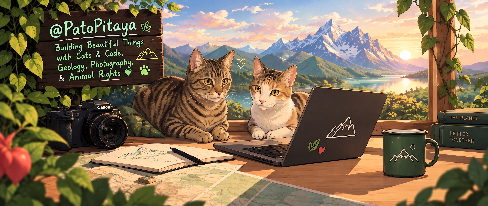

<div align="center">

<!-- Main Hero Banner -->


<br/><br/>

Hi, I'm Patricio
Geoscience background · Building my way into code · Photographer at heart

<p align="center">
  <span style="color: #84cc16;">🌱 Vegan & Animal Rights</span> &nbsp;•&nbsp; 
  <span style="color: #fb7185;">🐱 Cat Companion</span> &nbsp;•&nbsp; 
  <span style="color: #84cc16;">📍 Antwerp, Belgium</span>
</p>

<p align="center">
  <b>Languages:</b> Spanish (Native) · Dutch (B2) · English (B2)
</p>

---

</div>

### 🐾 About Me

I spent years reading the ground — rock layers, terrain, samples under a microscope. These days I read light and composition instead, but it's the same instinct: pay attention, look closer, understand the structure of things.

- 🌿 **Ethics & Compassion:** I'm vegan and I care about animal rights, not as a side note but as something that shapes how I see technology and progress in general. To me, none of it means much if it doesn't also make room for empathy toward every living being.
- 🐈 **The QA Team:** Fika and Flor, my two cats, supervise everything I do. Fika (brown tabby) mostly debugs the keyboard by sitting on it; Flor (calico) inspects whatever's on the desk and rearranges it without asking.
- 🌍 **Geology & Sustainable Mining:** Certified technician (NARIC-Vlaanderen recognized), with hands-on experience: geological consulting at SRK Consulting (Chile), precision GPS topography on an airport runway project, and quality control / mineral sampling here in Belgium (Martal Houtimport, Imerys).
- 💻 **Frontend & Code:** Teaching myself frontend development and web building, with a lot of trial, error, and AI as a coding partner — turning ideas into something that actually works on screen.
- 📷 **Photography:** I run @thepale_blue_dot, where the same eye trained on rock formations now goes looking for texture, light, and geometry in everyday places.
---

### Craft & Tools

```yaml
Programming:
  - JavaScript (ES6+)
  - React.js
  - Vite
  - Python
  - Semantic HTML5 & Modern CSS

Earth Science & Field:
  - Precision GPS Topography & Surveying
  - Geological Sampling & Testing
  - Industrial Quality Assurance (QA/QC)
  - Sustainable Resource Management

Creative:
  - Photography & Composition
  - Lightroom & Visual Curation
  - Responsive UI Layouts
